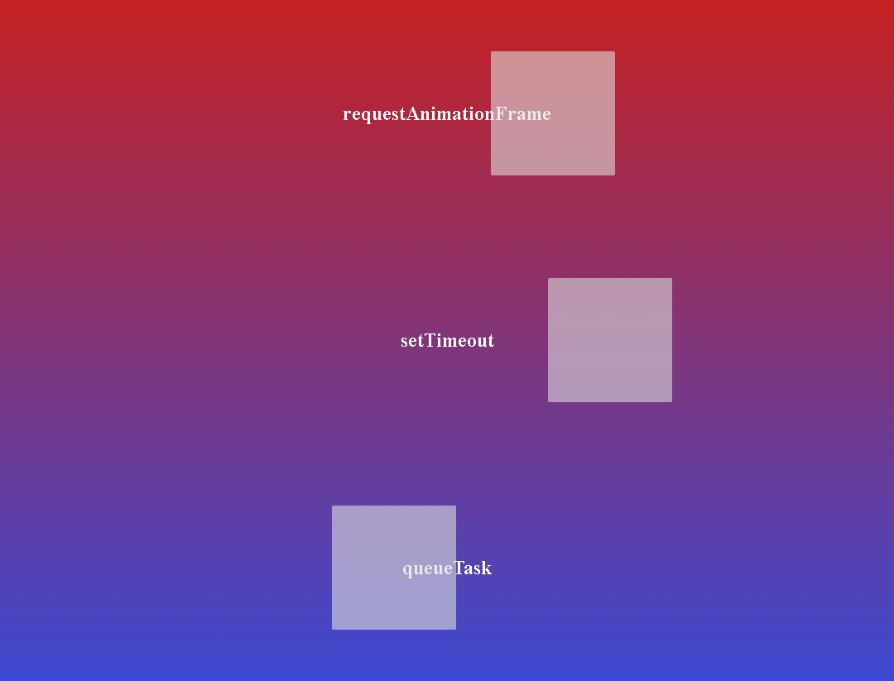

# Javascript Event Loop Sim

Attempting to replicate the example created by Jake Archibald in his talk at JSConf 2018, title [In The Loop](https://www.youtube.com/watch?v=cCOL7MC4Pl0&t=0s).

In this talk, Jake Archibald contrived a simulation of how the queueTask *would work* (starts at 12:50 of his talk), since there is no native function to actually que tasks. I made my best attempt at contriving a similar example (ie. using the MessageChannel API), yet I don't actually know if this is an accurate representation of queueTask behavior. Since I am still using setInterval to que the MessageSender tasks on the main thread, I suspect that this is not as accurate of an example as is Jake Archibald's. However, this is an interesting example, because if you increase the amount of MessageSender instances (ie. by updating loop condition on line 12 of channelParent.js) for each interval execution, you will see that it increasingly clogs the main thread and for some reason I don't fully understand yet, it increasingly reduces the velocity difference between requestAnimationFrame and setTimeout. 

> You must launch a local server for both `index.html` and `channel/channel.html` so that channel.html can be served in the iframe of index.html

Personally, I launch two instances of vscode and use the [Live Server extension](https://marketplace.visualstudio.com/items?itemName=ritwickdey.LiveServer) in each instance to launch one of the two required html servers (ie. first vscode instance launches live server for index.html, and the second vscode instance launchs live server for channel/channel.html)

